## 输入是一堆向量

之前的网络输入都是一个向量，而现在遇到的问题是网络的输入可能是一组向量，并且向量的数量可能不固定

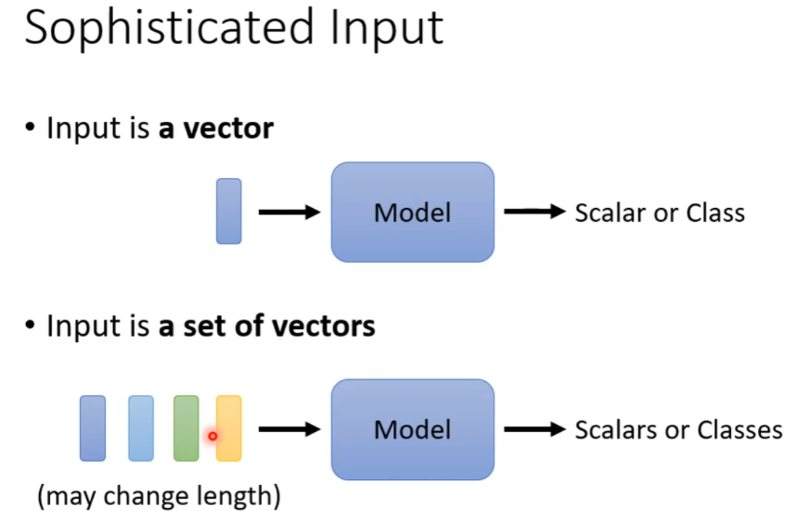

***

 例如对文本句子的处理，句子的长度不一样，所以网络输入的向量的个数就不一样。对于句子中的词，有one-hot和word-embedding的两种处理方法。one-hot忽略了单词间的关系（如动物、植物），而word-embedding可以做到。将一个句子，转变成一组词向量，句子长度不一样，所以词向量的个数就不一样。

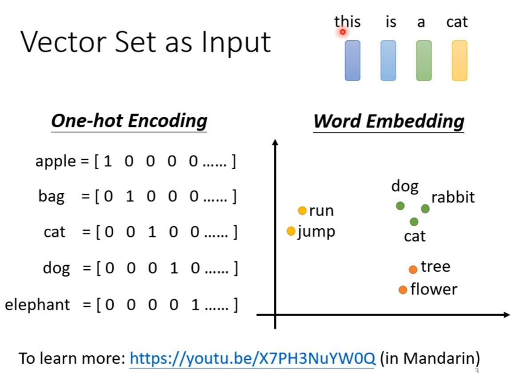

***

语音也是一堆向量，它是选择了一个滑动窗口，大小为25ms，之后将25ms的语音转变成一个向量，也就是一个frame，之后向后移动10ms，得到第二个frame。一个1s的语音有100个frame 

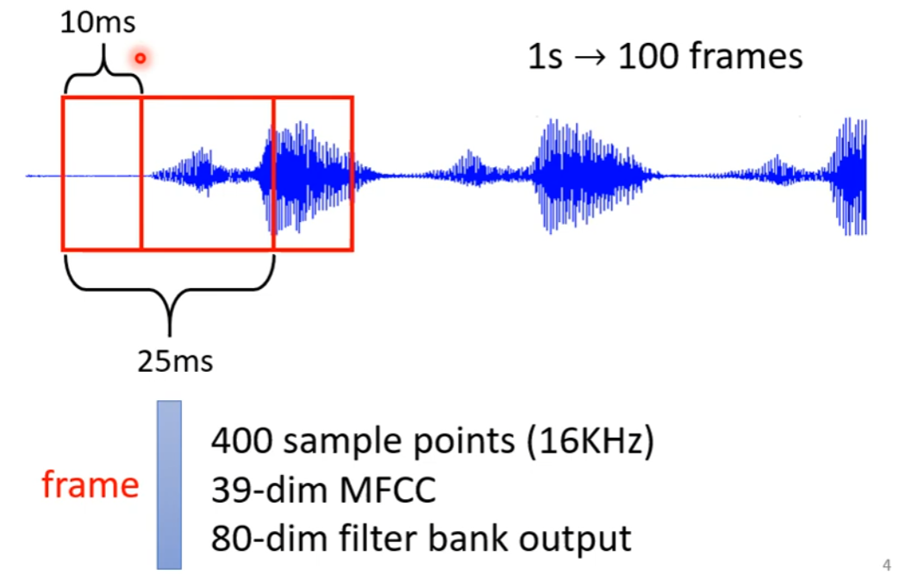

***

## Output

case1:输出和输入的长度一样，每个输入向量都有一个输出向量-->对每个词的词性标注

case2:输出一个label-->情感分析

case3:输出的长度未知-->seq2seq 机器翻译 

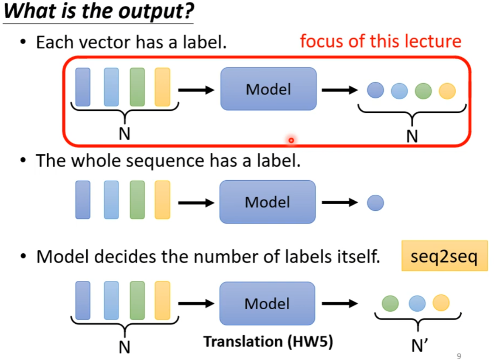

***

## Sequence Labeling

### Fully Connected

可以将每一个词分别丢尽network中，相当于各个击破，但是这样的话同样的词输出的结果是一样的，例如I saw a saw。

或者在输出一个词的词性的时，设定一个window,让其将前后五个词一起丢进去，输出相应的结果,效果还可以。

或者将window的大小设为整个句子的长度，再一起丢进去，但这样存在一定的问题：每个句子长度不一样，可能需要做padding。

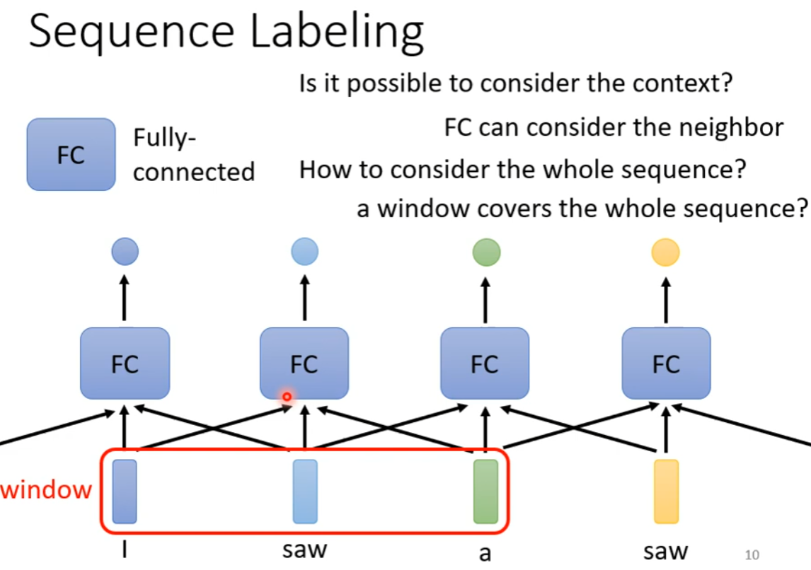

***

### self-attention 

由self-attention得到一组输出，其中的每一个输出都是考虑了整个句子的情况，之后将每个输出丢到fully-connected中得到结果

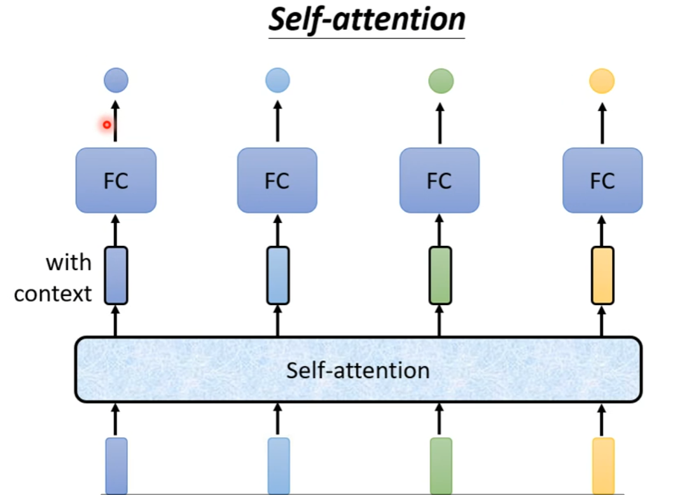

***

self-attention可以叠加多次，具体为self -attention处理整个句子的信息，fully connected专注于处理某一个位置的信息。

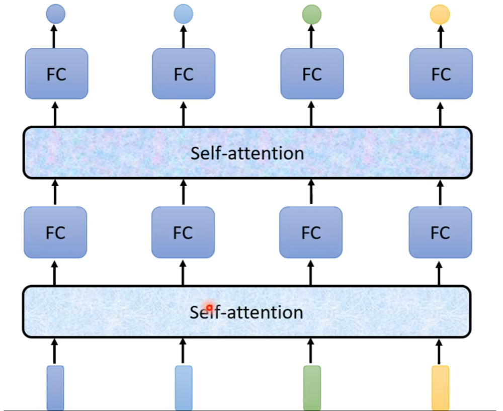

***

每个self-attention的输出都是考虑了整个句子信息才得到的。

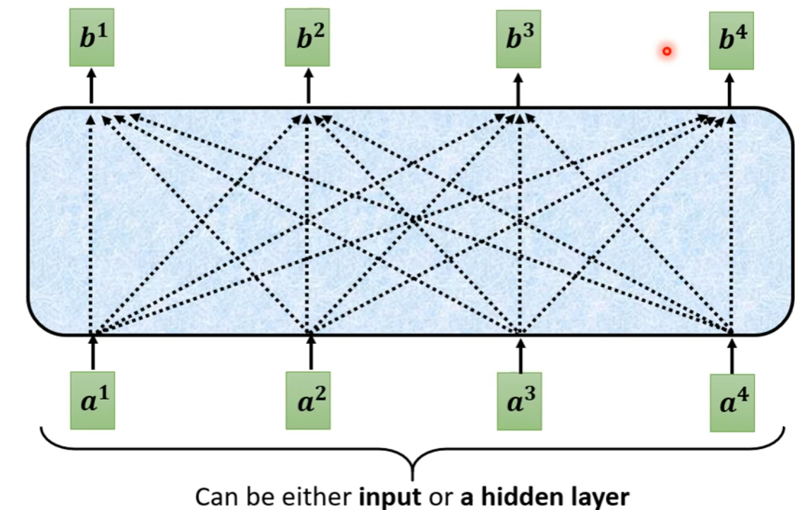

***

需要考虑向量间的关联性，例如a1和a4,两者间的关联性通过一个参数a来表示

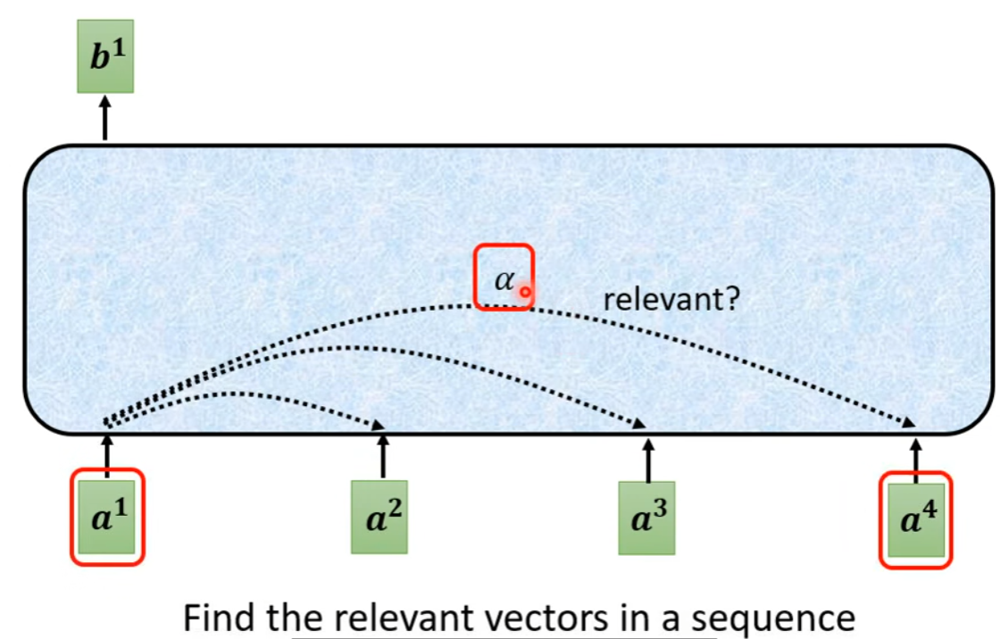

#### 如何计算a？

##### method1：

将两个向量分别乘上一个矩阵得到一个新的向量，之后让两个新向量q,k做点积，得到a。

##### method2:

得到q,k向量后让它们相加，之后过一个activate function，之后再transform一下，得到a。

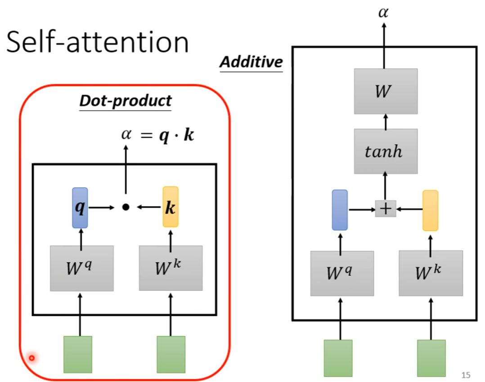

***

#### 如何将a套用在self-attention中

q是向量×Wq得到的，k是向量×Wk得到的

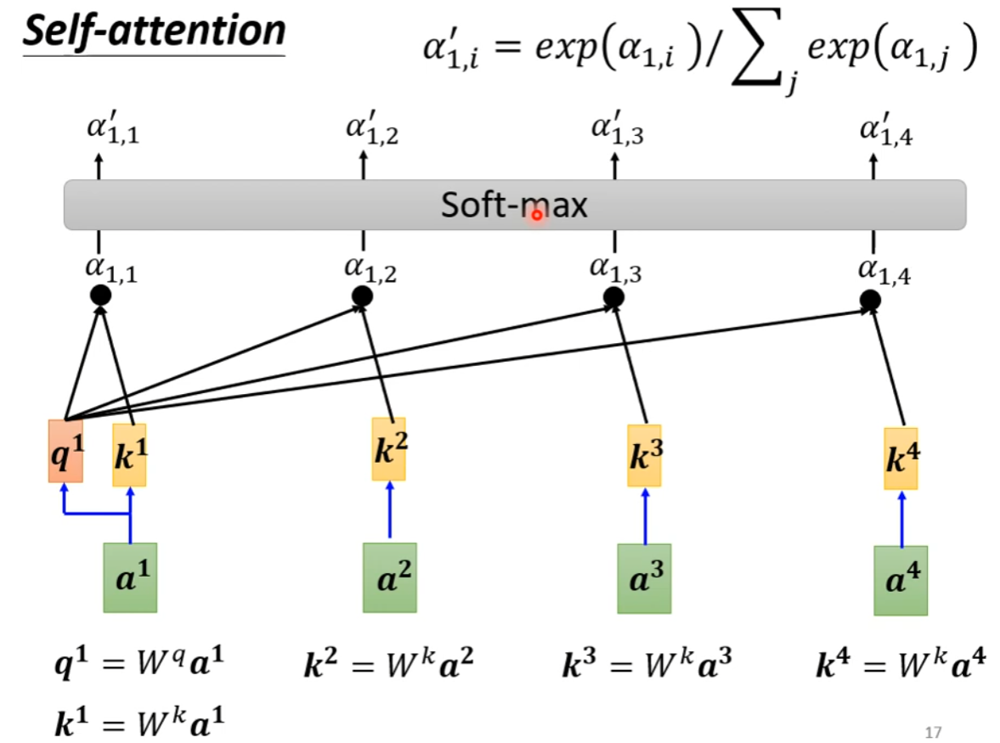

***

得到a'向量后，可以知道各个向量跟a1之间的关联性

v是向量×Wv得到的，a'就是attention的值，代表关联性越大，相应的v就会主导b

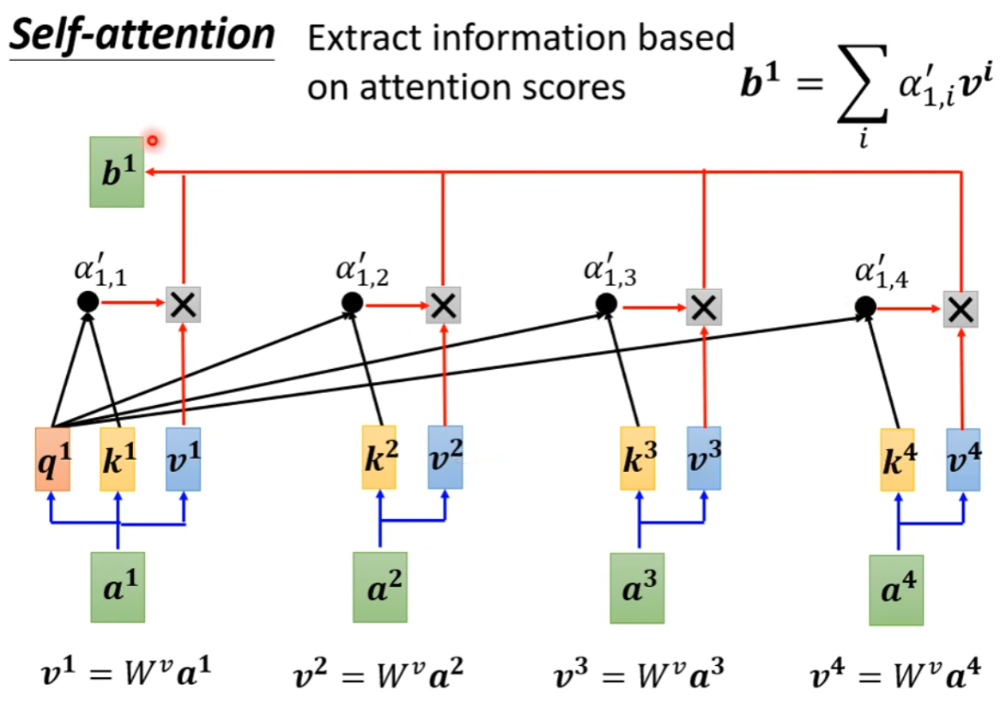

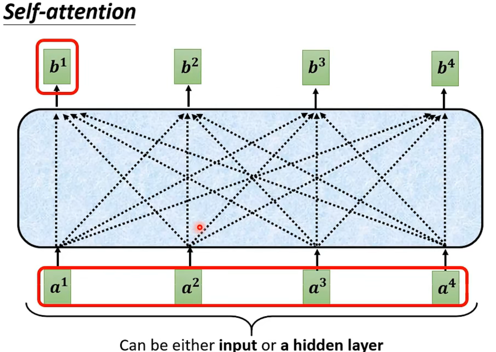
