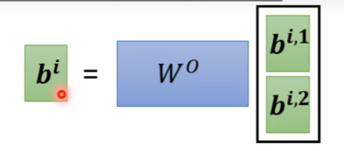

## 回顾

q:query    k:key (**找出输入之间的相关性**)

b2的得来：先由a2×一个transform得到q2,之后q2与ki点积得到每个的attention score,attention score需要再经过一次softmax，将softmax后的attention score与各个v相乘再求和即可。

---

### 矩阵运算的角度算q k v

将qi向量拼成一个矩阵Q，将ai拼成一个矩阵I，Q = Wq*I，K V同理也可得到

---

### 矩阵角度计算attention score

attention score1 = k1*q1。因此将得到的ki向量进行转置，之后将所有ki拼接成一个矩阵，将该矩阵与q1进行相乘，即可得到q1的attention score 的向量。其中a1,1是数。

---

将每个q向量乘以k矩阵，即可得到所有的attention分数。k矩阵的row是ki，q矩阵的column是qi。

---

如何得到b矩阵，将V矩阵（column是vi矩阵）与A矩阵相乘即可得到。v1与a11乘，v2与a22乘..之后结果相加即可得到v1.

---

### 总结

I是输入，O是输出，其中只有wq,wk,wv是需要学的参数 

 

---

## Muti-head Self-attention

语音、NLP相关任务用较多head可能效果好点 hyperparamter。所谓Muti-head是为了考虑多种相关性。

得到bi1 bi2后再×个矩阵 得到bi

---

## Positional Encoding

在self-attention中没有相应的位置信息，现在加了个向量ei，每个位置都用唯一的一个向量ei表示，之后用ei+原始的输入向量ai，之后再一起丢进去即可。

Position encoding尚需讨论

---

## Speech

由于语音信号太大了，一段一秒钟的语音，由一百条向量组成（每条向量10ms），因此attention的复杂度太高（长度的平方）

### Truncated self-attention

Truncated self-attention只是关注一个小范围内的内容，而不是看整个的输入。

## Image

将RGB图片的每一个位置看成一个三维的向量，那么一个5×10×3的图片就可以看成一个5×10的vector set，既然是一个vector set，那么就可以用self-attention

## Self-attention vs CNN

CNN(考虑一个receptive filed)是一个简化版的self-attention(考虑整个图)

Self-attention是一个复杂的CNN,Self-attention使用attention找出相关的pixel,attention network自己去学习receptive filed的位置，即哪些pixel是该考虑的

self-attention可以设定成CNN,更加灵活（flexible),模型flexible的话需要用大量的数据来训练，否则会overfitting

## Self-attention vs RNN

input都是vector set，output也是vector set

不同点：

RNN中最右边的输入向量若要考虑到最左边向量时，需要将最左边向量存起来，再一起考虑

而Self-attention在得到某一个输出向量时，会综合考虑所有input.

RNN无法平行产生所有输出（时间序列，一个一个产生），而Self-attention可以同时产生所有输出

---

## Self-Attention for graph

只有相连接的节点间才会有关联性，所以不相连的节点间无需考虑相关性，计算相连节点间的相关性即可。

将Self-attention用在graph上，即可得到GNN

