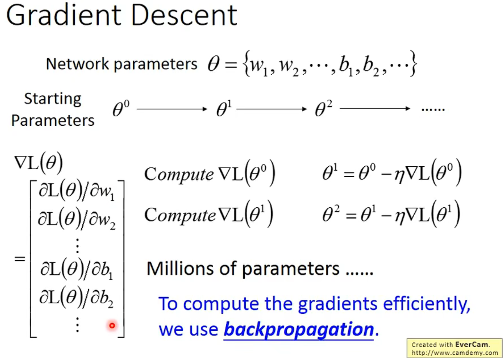
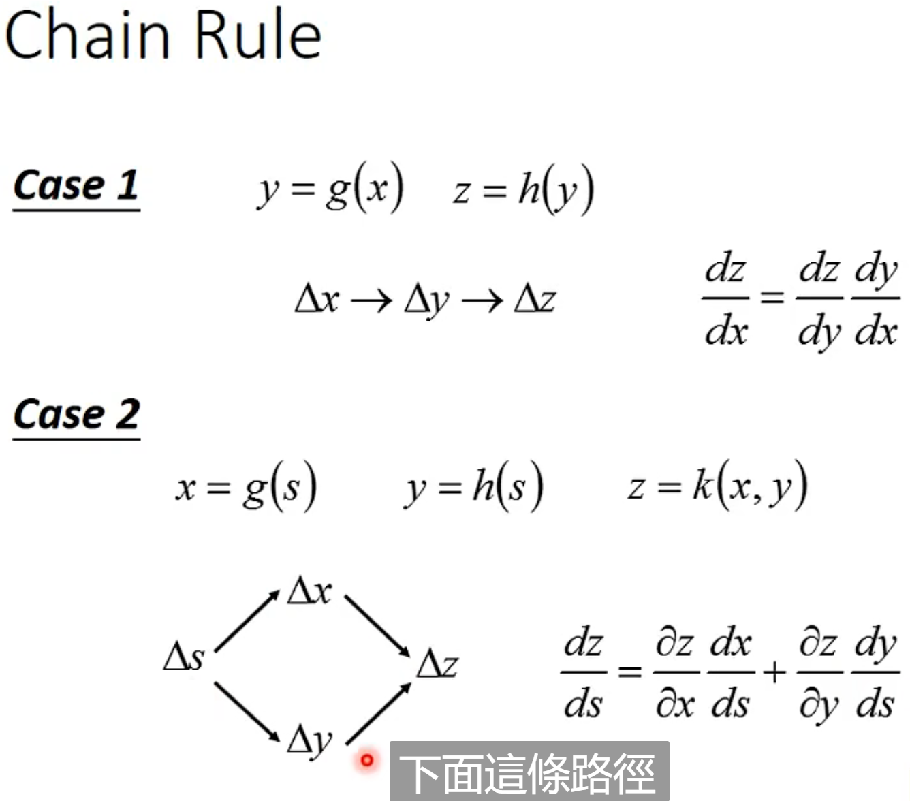
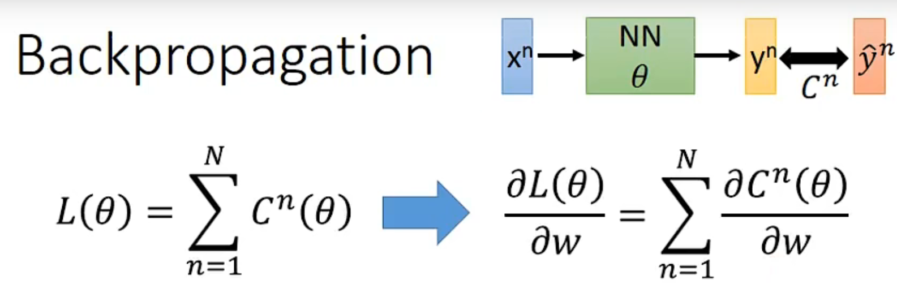
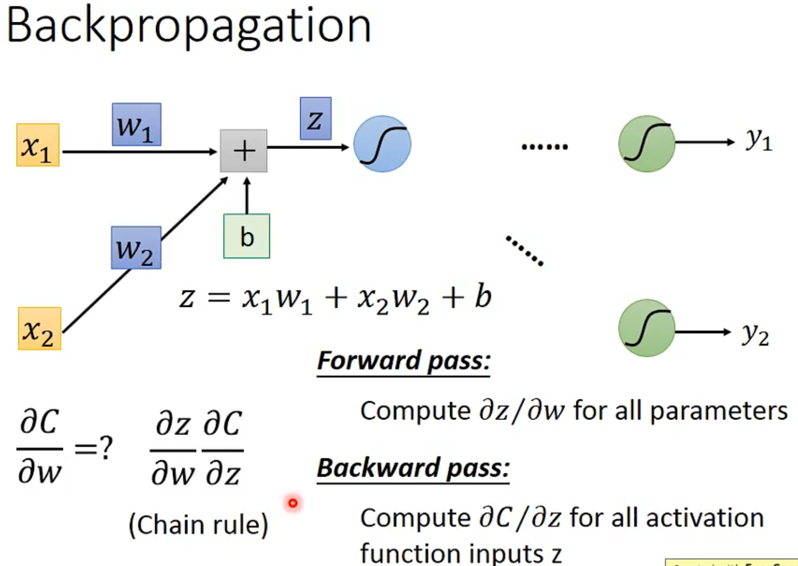
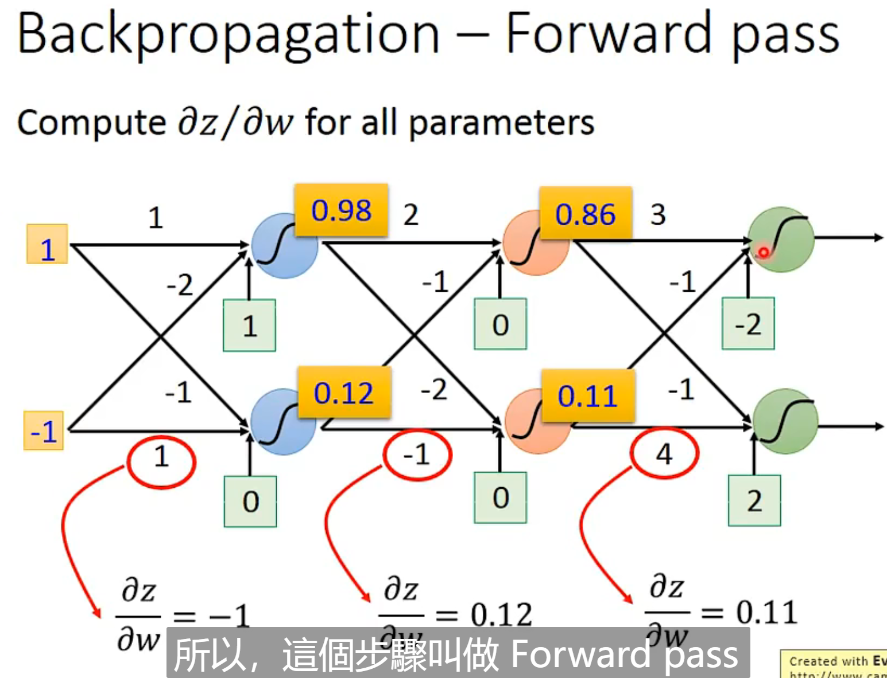
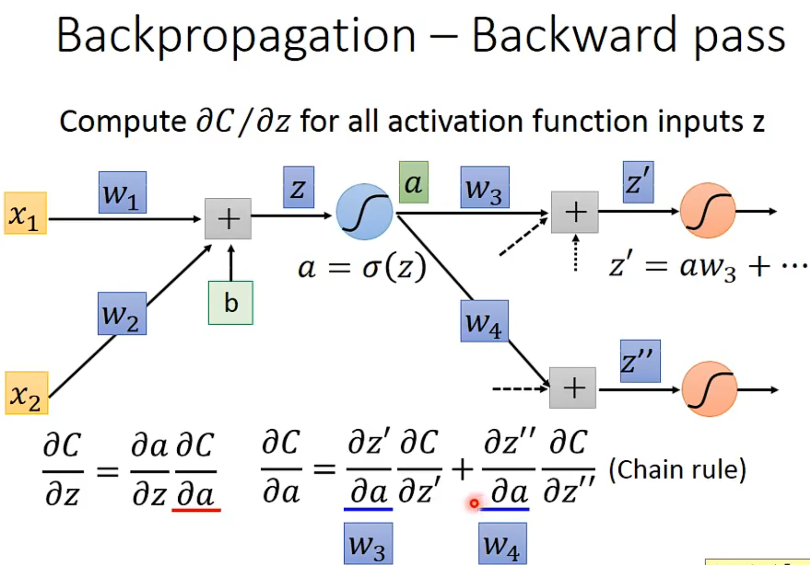
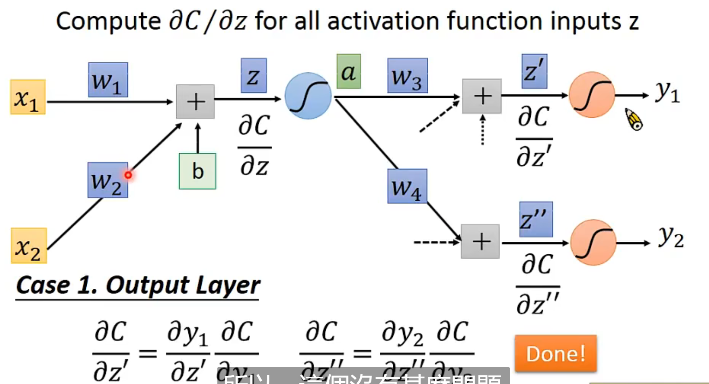
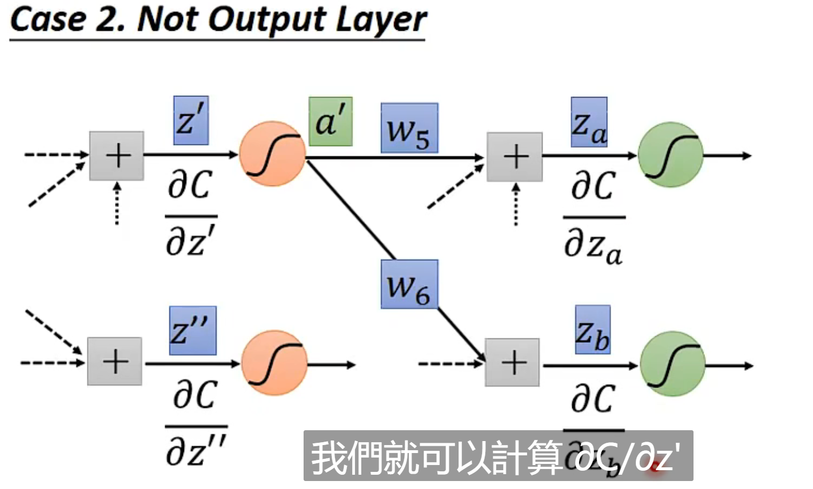
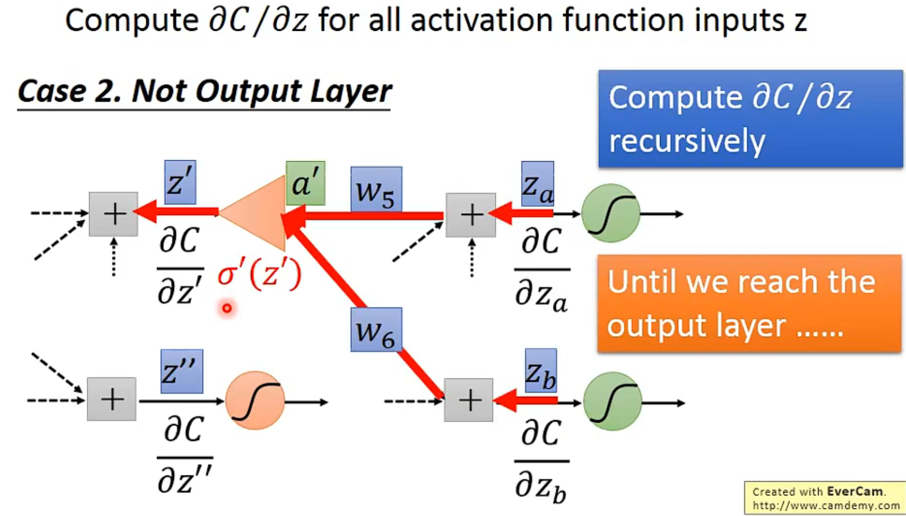
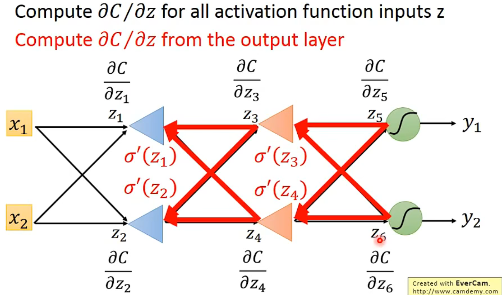

## 为什么使用BP

DNN中参数太多，只用Gradient Descent算较慢，所以提出了BP用来快速算出微分

## Chain Rule

## Loss Function

C^n表示的是预测结果和实际结果间的差值

由于是累计求和，所以只需要算其中一笔资料的微分即可，最终再求和

### Forward Pass

某一个神经元z的输出对其中一个参数w的偏微分，就是该参数对应的输入

### Backward Pass

下面需要算出C对z^'、z^'‘的微分

#### case1:后面直接就output了，没有其它层

#### case2:后面还有其他层，需要一直算到output层

为了算出C对z^’的微分，需要算C对Zb的微分。

##### 所以逆向整个过程

由后往前算微分，相当于将network倒置，先算后面的微分，之后再慢慢往前算微分
