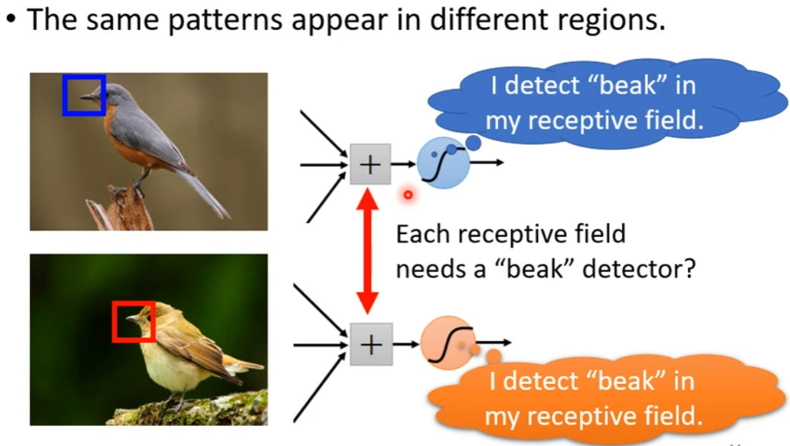

# CNN 介绍1

## 图像输入

图像输入是一个3D的tensor,其中有一维表示的是通道数，通道与RGB一一对应，将3D的tensor拉成1D后，可作为network的输入

## Fully Connected的问题

Fully connected会导致参数过多，因为每个神经元都需要接上所有的输入，过多的参数可能会导致overfitting。然而，考虑到图像的问题，某个神经元不需要考虑所有的输入，可以只考虑部分输入。 

### 观察1

我们可以通过判断图片中是否存在相应的特征来对图片进行判断（如鸟嘴、翅膀、眼睛），因此可以让一层中的神经元各司其职（如上图），一个神经元判断鸟嘴，一个神经元判断眼睛...

因为某些特征相较于整个图片而言较小，因此某个识别特征的神经元不需要扫描整个图片

### 简化1

每一个Neuron都有一个对应的receptive field,它只需要观察自己的receptive field即可，不需要观察整个图片，只需要将3*3 *3个数值作为输入，之后加上bias得到输出，将输出丢给下一层的神经元即可，至于receptive field的大小由自己决定。

不同的neuron可以有不同的receptive field, 不同的Neuron可以有相同的receptive field，并且不同neuron的receptive field之间可以有重合，并且receptive filed之间的大小可以不相同。 

#### 经典的receptive field设计方式

一般都会包含所有的通道，并且将receptive filed的大小设为（3 * 3*3），也就是kernal size = 3,每一个receptive field都有一组neuron来识别。并且可以通过设定stride来平移receptive field从而来覆盖整张图片，超出的部分用padding填充即可。

### 观察2

有些pattern会出现在图片的不同位置，例如鸟嘴，可能会出现在左上角也可能出现在中间，侦测鸟嘴的neuron做的事情是一样的，但是守备的范围是不一样的，不需要在每个范围都放一个neuron。

### 简化2：共享参数

让不同receptive field 的neuron共享参数，这样能保证该neuron就是用来侦测鸟嘴的。相同receptive field 的neuron不能共享参数，因为这样的话它们的输入是相同的，共享参数后，输出也相同   

#### 

#### 经典设计方法

每个receptive field有一系列的neuron，让每个receptive field中的neuron共享参数，从而每个neuron就叫filter.

## 卷积层的好处

1、通过receptive field的限制，使得neuron只能看一个范围内的图片，无法看整张图片，从而降低了网络的弹性。

2、通过共享参数，使得部分neuron的参数一样，进一步降低了网络的弹性，降低了overfitting的可能。

3、receptive field+共享参数 = 卷积层

CNN的model bias较大,因此是特定做图像任务的。Fully connected 的model bias较小，可能会overfitting，较小model bias可以做各种各样的事情，因此无法针对特定的任务。

# CNN 介绍2

## 卷积层

卷积层包含了一排filter,每个filter去检测3*3 * 3大小的区域从而识别相应的特征

### 工作原理

这里假设channel = 1，filter里的参数就是我们要训练的参数，这里假设已知。某一个filter通过stride来扫描整张图片，从而获得相应的特征，只有当扫描的区域左斜都是1时，才能获得最大值，所以该filter是用来检测区域左斜是否都是1的。因此相应的pattern出现在左上角和左下角

对每个filter重复上述filter1的操作，可以得到一个叫做feature map的东西。

卷积层可以不止一层，例如这里有两层，当第一层的卷积层输出后，可以得到一个64 * 4 * 4的tensor(64是因为有64个filter)，之后可以将这个tensor看作是一个新的图片传到下一层的卷积层中，因为该土拍你为64 * 4 *4，即相当于有64个channel。因此下一层的filter也必须是**64** * 3 *3

当第二层filter的范围是3*3的时候，它是在第一个卷积层输出后的tensor上进行查看，但是第一个卷积层的输出tensor是在原图像上看的3 * 3的范围，因此第二层filter看到的是第一层filter看到后的内容，识别到的pattern更大，相当于原始图片5 * 5的范围。因此，当卷积层越深，同样3 * 3大小的filter看的范围就越来越大。

# 两种介绍总结

neuron就相当于filter

第一种介绍中的参数共享(因为同一个pattern可能出现在一张图片的不同地方），其实就是将一个filter去扫整个图片来实现的，这件事称为convolution

CNN的核心就是Neuron只需要看图片的一部分，不需要一次性看一整张图片（Fully connected）

# 观察3

## Subsampling

将一张图片缩小并不会改变这个图片，缩小：将偶数的column去掉，将奇数的row去掉

## Pooling-Max Pooling（减小计算量）

将filter得到的结果进行2 * 2的分组，每一个2* 2中选择一个较大值作为代表，其中不一定要2 * 2，也可以选择其它的，也可以不选择max，可以选择平均数。

 

一般实际操作中就是一层卷积，一层pooling，如果算力够强，也可以不用pooling。

# 经典CNN架构

在经过最后的pooling后需要进行flatten，将矩阵拉直成一个长向量，之后将该长向量丢尽fully connected network，将fully connected network的结果进行softmax后即可得到最终结果。

# 应用

## Alphago

当作分类问题来解，19 * 19个位置（类别），将棋盘看成一个19 * 19的图片，一张图片有48个channel(因为每个位置可能有不同含义，啥叫吃啊之类的)

### 为啥可以用CNN

#### 相似处1：

不需要看整张图片，下围棋也是，可以只看一部分

#### 相似处2：

有些相同的特征（相同的部分布局）可能会出现在不同区域

#### 没有用pooling

棋局pooling后就和原棋局不一样了

# CNN缺点

无法辨别放大旋转后的图片，需要做data augmentation

## Data Augmentation

原始图片截一块出来，之后放大交给cnn，让cnn看过不同大小的pattern,或者将图片旋转

